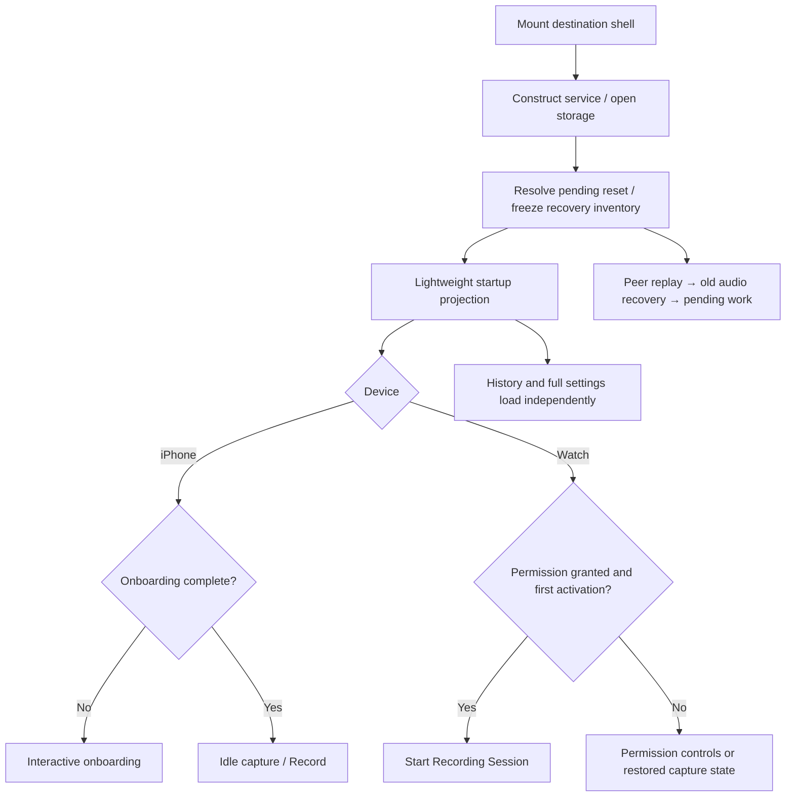

# iPhone and Apple Watch startup

Updated 2026-09-20 for capture-first startup. These are ordered milestones, not measured device timings. SwiftUI rendering and independent tasks can interleave.

Both apps mount their destination shell immediately. iPhone uses its persisted onboarding flag to choose the introductory page or idle capture shell; Watch shows its capture shell. Recording becomes available after essential storage preparation, without waiting for history, audio validation, optional permissions, webhook credentials, or synchronization.

## Timeline

| Stage | iPhone | Apple Watch | Background work |
| --- | --- | --- | --- |
| 1: first app frame | Introductory onboarding or idle capture shell, using the local onboarding hint. | Capture shell. | Construct the service and platform adapters off the main actor; open/migrate the database and create audio directories. |
| 2: model mounted | Subscribe to events and request the lightweight startup projection. | Subscribe to events and request the lightweight startup projection. | Watch Connectivity activates independently. |
| 3: capture preparation | Keep the chosen screen visible with preparation feedback. | Keep capture visible with preparation feedback. | Finish any pending destructive reset. Freeze the pre-existing recovery candidates using metadata/directory enumeration. Do not decode all audio. |
| 4: startup projection | Publish onboarding completion, microphone status, and active Recording Session. Enable Record; onboarding can advance. | Publish microphone/session state. First activation with granted permission starts capture automatically. | Microphone and onboarding reads are independent. Full settings and history load separately afterward. |
| 5: recording | User taps Record; claim audio ownership, persist a Recording Session, start hardware, and display the active recorder. | Start hardware and display elapsed time, Stop, and Discard with the start haptic. | Replay prior peer state, recover/validate old audio, resume eligible Workflows, and submit synchronization. Optional settings do not hold the capture queue. |
| 6: continued use | Stop publishes the saved Note immediately. Onboarding completion refreshes routing without joining history. | Stop returns to idle; history refresh follows independently. | Local history and playback read saved data independently of maintenance. History/settings failures remain independently actionable. |

The screen is visible before capture readiness. Preparation never claims the microphone is recording before hardware startup succeeds. Unknown Watch permission shows preparation feedback rather than an incorrect Allow microphone prompt.

## What still must precede capture

Database/schema availability, usable audio paths, event observation, pending destructive reset, and a fixed recovery inventory remain prerequisites. Inventory enumeration grows with stored metadata and filenames, but opening/decoding audio is deferred.

Recovery processes only inventoried candidates. File-descriptor ownership prevents it from finalizing audio belonging to a live Recording Session, including one created by a separately composed client. Candidates discarded since enumeration are ignored. Playable remnants become review-required Notes; they are never automatically delivered.

Prior peer mutations precede old-audio validation because both can affect the same Notes. Destructive reset and deletion pause new maintenance, cancel/join existing work, and then erase. New capture does not wait for ordinary maintenance; destructive operations deliberately retain coordination with capture. A maintenance error does not prevent Reset Whim from clearing the store.

## iPhone routing and onboarding

The canonical lightweight projection replaces the persisted routing hint after preparation. Pending reset can return iPhone to onboarding. Webhook availability does not gate entry to capture.

Onboarding remains: **Get started → configure/test webhook or skip → microphone permission or continue without it**. The introduction appears before full settings; the configuration editor loads independently. Completing onboarding updates routing immediately and schedules auxiliary refresh afterward. Speech and notification permission offers remain contextual after a saved Note.

Opening iPhone does not start recording automatically. A warm scene activation restores state. Existing deep links can navigate to settings or a Note after navigation preparation. During capture, history/settings navigation remains unavailable.

Sources: [app entry](../src/iphone/app-composition/WhimIPhoneApp.swift), [routing](../src/iphone/app-composition/IPhoneRootView.swift), [presentation model](../src/iphone/app-composition/IPhoneModel.swift), [onboarding](../src/iphone/onboarding/OnboardingView.swift).

## Watch lifecycle

Watch has no separate onboarding. Granted permission on first model activation starts one Recording Session. Undetermined permission exposes Allow microphone after preparation; granting the request starts capture. Denied/restricted access shows an actionable error with device-specific guidance.

Returning after wrist-down or after Stop restores state without starting another Recording Session. Returning from Settings refreshes permission; after the first activation, Record remains an explicit action. Existing sessions are restored without duplicate start haptics. Crash recovery produces a review-required Note rather than resuming an old microphone session.

The Watch runtime shares one composition task between foreground and Watch Connectivity background entry points. A background callback starts maintenance and participates in background-task completion accounting, without constructing a model or auto-starting capture.

Sources: [app/runtime](../src/watch/app-composition/WhimWatchApp.swift), [activation](../src/watch/recording/WatchModel.swift), [capture screen](../src/watch/recording/WatchRecorderView.swift).

## Errors

Both devices show a rounded Liquid Glass container in the upper part of the screen. Earlier supported systems use material; Reduce Transparency uses an opaque background. Messages are sanitized and wrap to their content size. The compact card itself is the recovery action: tap anywhere on its glass surface. There is no separate action button or reserved scrolling area. VoiceOver announces the action; auxiliary errors can be dismissed with a horizontal swipe or the accessibility action.

- Preparation/capture failures offer Try again.
- Microphone denial opens iPhone Settings or Watch instructions.
- Storage exhaustion offers instructions and Check again.
- History/settings failures offer targeted retries and can be dismissed.
- Background maintenance failures identify recovery/synchronization as the failed work; local history and playback stay available.
- Playback failures explain the audio/player problem and retry the same Note. The glass container is hosted in the open history sheet, above its content, and clears when leaving history.
- Unrelated failed actions offer Refresh rather than repeating a recording command.

Capture-blocking errors take precedence. Auxiliary errors do not remove the recorder. System failures are not rendered as raw exception strings. Service construction and failed maintenance can be retried; configuration-test audio is resolved when the user invokes Test webhook rather than during ordinary production startup.

## Verification and remaining measurement

Regression tests hold old recovery, optional settings, or webhook-test HTTP unfinished and verify that capture/Stop still completes. Presentation tests verify that onboarding completion does not join the slow auxiliary refresh. Recovery tests verify live-writer exclusion and frozen candidate sets. Installed journeys cover permission guidance and preparation failure/retry.

These prove dependency removal, not a numeric cold-launch speedup. Real-device measurements should record first destination appearance and microphone onset separately, for cold/warm launches and empty/populated stores. Physical acceptance also checks wrist-down capture and initial speech preservation. See [iPhone acceptance](../e2e/physical/iphone-presentation.e2e.test.md) and [Watch acceptance](../e2e/physical/watch-capture.e2e.test.md).

Core sources: [WhimClient](../packages/WhimCore/Sources/WhimCore/AppComposition/WhimClient.swift), [service and composition](../packages/WhimCore/Sources/WhimCore/AppComposition/WhimService.swift), [recovery](../packages/WhimCore/Sources/WhimCore/Recovery/RecoveryScanner.swift), [audio ownership](../packages/WhimCore/Sources/WhimCore/Notes/AudioFileStore.swift).

## Follow-up regression: apparent missing history and failed playback

The first implementation kept `listNotes`, Note detail, waveform, and playback behind the full `launch()` maintenance gate. A failure in recovery or synchronization therefore prevented any history snapshot from reaching the interface, even with valid metadata and audio on disk. A fresh model displayed an empty list; newly captured Notes appeared via events, but their playback hit the same failed gate. This explains the reproduced symptom without requiring deletion. The prior startup tests covered capture independence but missed local browsing/playback during maintenance failure.

Local reads and playback now join only essential preparation. `WhimClient.maintain()` runs independently and reports a separate error; completion refreshes history. Deletion cancels and joins maintenance, then presentation resumes remaining recovery. Targeted tests reproduce a sent Note and a new Note remaining playable after failed recovery, history survival, delete-during-recovery resumption, and playback retry within the modal. The installed `playback-error` journey verifies that the message and action are visible without dismissing history.

The reported physical iPhone was updated in place. The production storage path was unchanged by this patch. The paired device was inspected read-only after connection. Apple’s device file service refused the top-level `Whim/whim.sqlite` path because only `Library`, `Documents`, and `tmp` are exposed. The actual stored Note count and original maintenance exception therefore remain unverified; an empty exposed-container listing is not evidence of deletion. No reset, deletion, reinstall, or repair was performed on that physical device.
